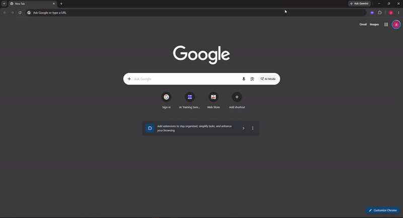
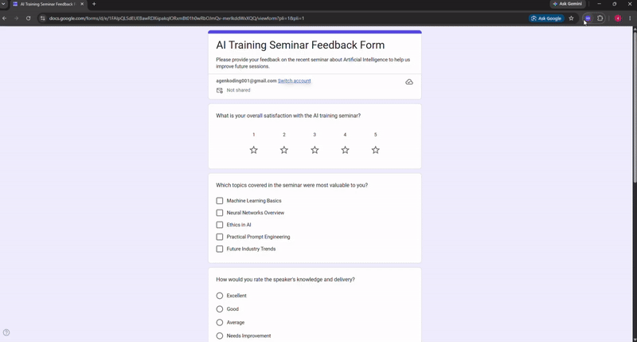
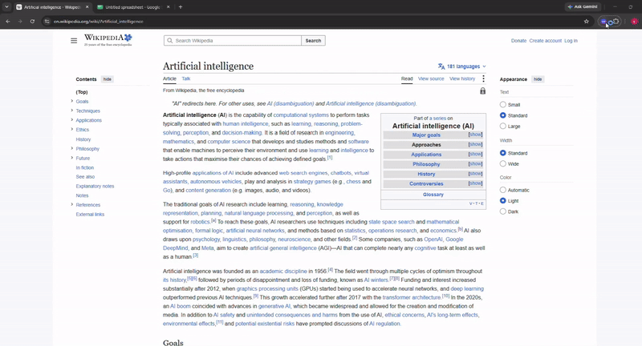

<div align="center">


# SAM-Agent
### Autonomous AI Browser Assistant, Co-Pilot & Local Automation Workspace

[](package.json)
[](https://developer.chrome.com/docs/extensions/develop/migrate/what-is-mv3)
[](https://react.dev/)
[](https://www.typescriptlang.org/)
[](https://wxt.dev/)
[](https://tailwindcss.com/)
[](LICENSE)

*A privacy-first, local-first autonomous AI browser agent and pair programmer in your Chrome side panel — capable of deep DOM perception, visual grounding with Set-of-Marks, multi-tab scraping & orchestration, full CDP network inspection, self-healing execution loops, rich document generation (Word, Excel, PowerPoint), RAG over virtual files, and encrypted multi-layer vault security.*

</div>

---

## 🌟 Overview

<div align="center">
  
</div>

**SAM-Agent** is an advanced, production-grade autonomous browser co-pilot built as a Chrome Extension (Manifest V3). It combines top-tier LLM reasoning with native Chrome APIs (`chrome.debugger` CDP 1.3, `chrome.scripting`, `chrome.tabs`, `chrome.alarms`, and HTML5 `FileSystemAccessAPI`) to deliver a true co-pilot experience directly inside your browser.

Unlike superficial chatbots, SAM-Agent can **inspect deep DOM trees**, **execute self-healing actions**, **sniff live network traffic**, **manage parallel multi-tab workflows**, **generate production-ready documents (DOCX, XLSX, PPTX)**, and run scheduled autonomous background routines even when the side panel is closed.

---

## 🚀 What's New in v4.6.1

- 🗂️ **Collapsible Accordion Settings Suite**: 8 modular category cards with live counter, instant "Expand All" / "Collapse All" controls, and seamless configuration for AI Engine, Soul, Optimization, Web Search, Memory, Domain Caveats, Backup, and Permissions.
- 🛡️ **Full Data & Config Backup, Export & Encrypted Restore (v4.6.0)**: Quick JSON backup or complete `.zip` workspace archive with optional **AES-GCM 256-bit passphrase encryption**, granular restore options, atomic database transactions, and emergency factory reset.
- 📊 **Dedicated Excel (.xlsx) Spreadsheet Studio (v4.5.1)**: Native `generateExcel` tool using SheetJS, multi-sheet workbook navigation, real-time cell search, column sorting, pagination, and instant CSV export.
- 🔒 **Human-in-the-Loop Sensitive Action Guard (v4.5.0)**: Real-time risk detection modal before executing sensitive actions (financial checkouts, deletions, destructive form submissions).
- 🗃️ **Smart Form Auto-Filler & Encrypted Profile Vault (v4.4.2)**: AES-GCM encrypted local vault for identity, credentials, addresses, and payment profiles with fuzzy semantic form auto-filling.
- 📑 **Parallel Multi-Tab Orchestration & Batch Scraper (v4.4.0)**: Concurrent tab scraping and cross-tab data pipelines.
- 🌐 **CDP Kernel Network Inspector & Error Sniffer (v4.3.2 - v4.3.3)**: Ephemeral CDP 1.3 network inspection and passive console error capture with automated token & credential redaction.
- 🔍 **Local Chunked RAG & Semantic Memory (v4.3.0 - v4.3.1)**: Autonomous vector-like retrieval over VFS documents, episodic long-term memory, and learned domain-specific selector caveats.

---

## ✨ Comprehensive Feature Matrix

### 1. 🧠 Multi-Provider AI Engine & Thinking Models
- **Universal Model Compatibility**:
  - **Google Gemini**: `gemini-2.0-flash`, `gemini-2.0-pro-exp`, `gemini-1.5-pro` with native thinking level budget controls.
  - **Anthropic Claude**: `claude-3-7-sonnet` (with hybrid reasoning), `claude-3-5-sonnet`, `claude-3-5-haiku`.
  - **OpenAI**: `gpt-4o`, `gpt-4o-mini`, `o1`, `o3-mini`.
  - **Groq & Cerebras**: Ultra-fast low-latency inference (`llama-3.3-70b-versatile`, `deepseek-r1-distill`).
  - **OpenRouter**: Access hundreds of open-source and proprietary models with custom routing.
  - **DeepSeek & Zhipu GLM**: `deepseek-chat`, `deepseek-reasoner`, `glm-4-plus`.
  - **Local Private Models**: Direct connection to **Ollama** (`http://localhost:11434`) or **LM Studio** (`http://127.0.0.1:1234`) — 100% private, zero telemetry leaving your machine.
  - **Custom OpenAI Compatible Endpoints**: Full base URL & custom model string override.
- **Context Optimizations**:
  - **RTK Trimming**: Smart real-time tool call compaction to conserve token budgets.
  - **Ponytail Compression**: Adaptive conversation summarization for long-running workflows.

### 2. 🌐 Autonomous Browser Automation & Self-Healing Execution
- **Intelligent Page Reader**: Compacts raw HTML into semantic trees, extracting forms, tables, ARIA landmarks, and rich text editors (TinyMCE, CKEditor, Quill, ProseMirror).
- **Visual Grounding & Set-of-Marks (SoM)**: When CSS selectors are ambiguous or hidden behind shadow DOMs, SAM-Agent overlays numerical visual tags (`clickTag`, `fillTag`) for infallible element targeting.
- **Deterministic Post-Action Verification**: Automatically checks whether a click or form submission produced the expected DOM state, retrying or self-healing with alternative strategies if failed.
- **Sensitive Action Guard**: Prompts for user confirmation via a Human-in-the-Loop security modal before executing high-risk web actions.

<details>
  <summary><b>🎬 View Automation Demos</b></summary>
  <div align="center" style="margin-top: 10px; margin-bottom: 12px;">
    <p><b>Browser Interaction:</b></p>
    
    <p style="margin-top: 16px;"><b>Intelligent Form Filling:</b></p>
    
  </div>
</details>

### 3. 📑 Multi-Tab Orchestration & Batch Scraping
- **Cross-Tab Awareness**: Instant discovery of all open browser tabs.
- **Tab Lifecycle Automation**: Switch (`switchTab`), open research targets (`openTab`), and close tabs (`closeTab`) dynamically.
- **Parallel Batch Scraper**: Collect data concurrently across multiple tabs, aggregate results, and feed them into unified reports or database files.

<details>
  <summary><b>🎬 View Multi-Tab Pipeline Demo</b></summary>
  <div align="center" style="margin-top: 10px; margin-bottom: 12px;">
    
  </div>
</details>

### 4. 📊 Professional Document Generators & Rich Artifact Viewer Suite
SAM-Agent includes dedicated document generators and full-featured native previewers:
- **Excel (.xlsx) Studio**: Built-in `generateExcel` tool using SheetJS with multi-sheet support, cell filtering, sorting, pagination, and CSV export.
- **Word (.docx / .doc) Studio**: Built-in `generateDoc` tool producing styled A4 documents with headings, bullet points, tables, and live pagination preview (`docx-preview`).
- **PowerPoint (.pptx) Presentations**: Built-in `generatePptx` tool using PptxGenJS creating 16:9 widescreen slides with modern themes (Corporate Blue, Dark Slate, Emerald, Modern Purple) and interactive slide previewer.
- **Interactive Mermaid v12 Studio**: Full diagramming (flowcharts, sequence, Gantt, class, mindmap) with smooth GPU pan & zoom, dark/light themes, and PNG/SVG export.
- **JSON Tree & Table Inspector**: Interactive collapsible nodes, depth limiters, path extraction (`users[0].address`), and instant tabular view.
- **SVG Inspector**: Visual canvas with zoom/pan, checkerboard/light/dark background modes, and high-res PNG exporter.
- **Log Stream Viewer**: Color-coded badges (`ERROR`, `WARN`, `INFO`, `DEBUG`), keyword search with highlight, and line jump controls.
- **Audio Studio Player**: HTML5 player with animated spectrum equalizer, scrub timeline, playback rate pills (0.5x–2.0x), and loop controls.
- **ZIP Archive Explorer**: Inspect archive structures, extract individual files, or unpack entire archives directly into the Virtual File System.
- **PDF Viewer**: Embedded native Chromium PDF rendering with search, zoom, and print.

### 5. 💾 Virtual File System (VFS) & Local-First Storage
- **Dexie.js IndexedDB Engine**: Lightning-fast in-browser file storage for code, datasets, notes, and generated documents.
- **Local Directory Mount**: Mount any real directory on your operating system via the HTML5 File System Access API with two-way sync.
- **Local Chunked RAG**: Smart file chunker indexer providing semantic context injection for large local files into LLM prompts.
- **GitHub Gist Sync**: Publish generated scripts, markdown notes, or code directly to GitHub Gists in one click.

### 6. 🛡️ Data Backup, Restore & Encrypted Security
- **Quick Backup (JSON)**: Fast lightweight export of configuration, threads, memories, and tools.
- **Full Archive (.zip)**: Complete workspace backup including all binary files, documents, and VFS tree.
- **Military-Grade Encryption**: Optional **AES-GCM 256-bit PBKDF2** passphrase encryption for all backup packages.
- **Selective Restore**: Choose precisely which components to restore (Settings, API Keys, Chat History, VFS, Memory, Tools, Vault, Routines).
- **Safety Pre-Restore Snapshot & Atomic Transactions**: Never lose state during an import; automatically snapshots existing data.
- **Factory Reset**: Emergency reset with typed confirmation string for fresh installations.

### 7. ⏰ Background Routines & Autonomous Cron Scheduler
- **Chrome Alarms Service Worker**: Runs scheduled automations (e.g. scrape news every 30 minutes, monitor prices, generate daily reports) even with the side panel closed.
- **System Desktop Notifications**: Notifies you with rich summaries when background tasks complete.
- **Run Audit Log**: Complete history of execution timestamps, status, outputs, and errors.

### 8. 🔍 Fast Web Search & Autonomous Research
- **Zero-Config Search**: Free built-in DuckDuckGo web search integration.
- **API Search Providers**: Optional high-speed Brave Search and Tavily AI Search integration.
- **Autonomous Web Research**: SAM-Agent searches, visits top results, extracts content, and synthesizes answers automatically.

### 9. 🧬 Persona Tuning via `SOUL.md` & Domain Memory
- Customize agent personality, style, language, and core directives in `/soul.md`.
- **Episodic Memory**: Remembers user preferences, project context, and past interactions across sessions.
- **Autonomous Domain Memory**: Automatically records tricky CSS selectors, pop-up closers, and login caveats per web domain to improve future visits.

---

## ⌨️ Default Shortcuts

| Shortcut | Action | Scope |
| :--- | :--- | :--- |
| `Ctrl + Shift + L` (Mac: `Cmd + Shift + L`) | Toggle SAM-Agent Side Panel | Browser Global |
| `Ctrl + Shift + .` (Mac: `Cmd + Shift + .`) | Open Quick Floating Command Palette | In-Page Overlay |

---

## 🚀 Getting Started

> 📖 **Panduan Instalasi Lengkap (Bahasa Indonesia):** Lihat [**INSTALL.md**](INSTALL.md) untuk panduan visual langkah demi langkah ke Google Chrome.

### Prerequisites
- [Node.js](https://nodejs.org/) (version 20 or higher recommended)
- [npm](https://www.npmjs.com/) (version 10 or higher)
- Google Chrome or any Chromium-based browser (Edge, Brave, Arc, Opera, Vivaldi)

### Development Setup

1. **Clone the repository:**
   ```bash
   git clone https://github.com/nice0ne/sam-agent.git
   cd sam-agent
   ```

2. **Install dependencies:**
   ```bash
   npm install
   ```

3. **Start development mode with hot-reload:**
   ```bash
   npm run dev
   ```
   WXT will automatically launch a dedicated Chromium profile with the extension pre-loaded and live hot-reloading active.

4. **Verify TypeScript compilation:**
   ```bash
   npm run compile
   ```

5. **Build and package extension:**
   ```bash
   npm run build     # Compiles to .output/chrome-mv3
   npm run zip       # Packages production zip into .output/sam-agent-ui-4.6.1-chrome.zip
   ```

---

## 📦 Loading into Google Chrome (Manual Install)

1. Run the build command:
   ```bash
   npm run build
   ```
2. Open Google Chrome and navigate to `chrome://extensions`.
3. Enable **Developer mode** using the toggle in the top-right corner.
4. Click **Load unpacked** (Muat yang belum dibongkar).
5. Select the `.output/chrome-mv3` folder inside the `sam-agent` directory.
6. Click the SAM-Agent puzzle icon or press `Ctrl + Shift + L` to open the side panel!

---

## 🏗️ Architecture & Project Structure

```
Sam-Agent/
├── entrypoints/                      # WXT Manifest V3 Extension Entrypoints
│   ├── background/                   # Background Service Worker & Alarm Scheduler
│   ├── sidepanel/                    # Main React Side Panel Application UI
│   ├── quick-command.content/        # In-page floating command palette overlay
│   ├── editor/                       # Fullscreen Code Editor window
│   ├── viewer/                       # Standalone Artifact & Document Viewer
│   ├── picker/                       # Native File System Access authorization dialog
│   └── voice-popup/                  # Microphone permissions bridge
├── src/
│   ├── components/                   # Modular React 19 UI Components
│   │   ├── chat/                     # Message cards, streaming bubbles, tool executions
│   │   ├── editor/                   # CodeMirror 6 code studio wrapper
│   │   ├── files/                    # VFS file tree explorer, mount manager, import/export
│   │   ├── history/                  # Conversation threads & search
│   │   ├── scheduler/                # Background Cron Task manager UI
│   │   ├── settings/                 # Collapsible Category Settings, Backup & Restore
│   │   ├── tools/                    # Tool Studio scriptlet editor & playground
│   │   ├── vault/                    # Encrypted Profile Vault & Auto-fill manager
│   │   └── viewer/                   # Rich multi-format previewers (Excel, Word, PPTX, JSON, etc.)
│   ├── services/                     # Core Business Logic & Automation Engines
│   │   ├── chat-runner.ts            # LLM streaming loop, tool executor & reasoning loop
│   │   ├── page-actions.ts           # CDP 1.3 & DOM automated interaction engine
│   │   ├── page-reader.ts            # Compact semantic DOM & form structure extractor
│   │   ├── visual-grounding.ts       # Set-of-Marks (SoM) visual tag overlay engine
│   │   ├── self-healing.ts           # Deterministic post-action verification & recovery
│   │   ├── cdp-inspector.ts          # Ephemeral CDP network kernel inspector
│   │   ├── passive-sniffer.ts        # Passive network & console error sniffer with redaction
│   │   ├── backup.ts                 # Full backup, zip archiving & AES-GCM encryption
│   │   ├── restore.ts                # Selective restore engine & atomic DB transactions
│   │   ├── excel-generator.ts        # SheetJS workbook generator & CSV converter
│   │   ├── pptx-generator.ts         # PptxGenJS widescreen slide deck generator
│   │   ├── doc-generator.ts          # Word document builder & table formatter
│   │   ├── rag.ts                    # Local file chunker & semantic context retriever
│   │   ├── scheduler.ts              # Chrome Alarms API task coordinator
│   │   ├── scheduler-runner.ts       # Headless agent background task executor
│   │   ├── tool-registry.ts          # Custom scriptlet sandbox runner
│   │   ├── vfs.ts                    # Virtual File System abstraction
│   │   ├── handle-store.ts           # Native File System directory handle sync
│   │   ├── soul.ts                   # Agent persona & directive persistence
│   │   └── db.ts                     # Dexie.js IndexedDB schema & queries
│   ├── stores/                       # Zustand Reactive State Management
│   └── types/                        # Strict TypeScript Type Definitions
├── public/                           # Static assets, SVG/PNG icons, web fonts
├── wxt.config.ts                     # WXT extension configuration & permissions
├── package.json                      # Version 4.6.1 dependencies & scripts
└── tsconfig.json                     # Strict TypeScript compiler options
```

---

## 🔒 Security & Privacy Commitments

- 🔑 **Local Credential Storage**: All API keys, search keys, and custom endpoints are stored exclusively in Chrome's encrypted `chrome.storage.local`.
- 🔐 **AES-GCM Encrypted Vault & Backups**: Passwords, identity profiles, and exported workspace backups can be encrypted using industry-standard **AES-GCM (256-bit)** key derivation (PBKDF2 with 100,000 iterations).
- 🛡️ **Human-in-the-Loop Safeguards**: High-risk browser actions (purchases, data deletions, system configuration changes) trigger explicit confirmation modals.
- 🧹 **Automatic Secret Redaction**: Network and console error sniffers scrub Authorization headers, Bearer tokens, cookies, and API keys automatically.
- 🚫 **Zero Third-Party Telemetry**: No trackers, external analytics, or remote logging libraries are present.

---

## 🤝 Contributing

Contributions, feature requests, and bug reports are welcome!

1. Fork the repository.
2. Create your feature branch (`git checkout -b feature/amazing-feature`).
3. Ensure strict TypeScript types pass (`npm run compile`).
4. Commit your changes (`git commit -m 'feat: add amazing feature'`).
5. Push to the branch (`git push origin feature/amazing-feature`).
6. Open a Pull Request.

---

## 📄 License

This project is licensed under the **MIT License**. See the [LICENSE](LICENSE) file for details.
